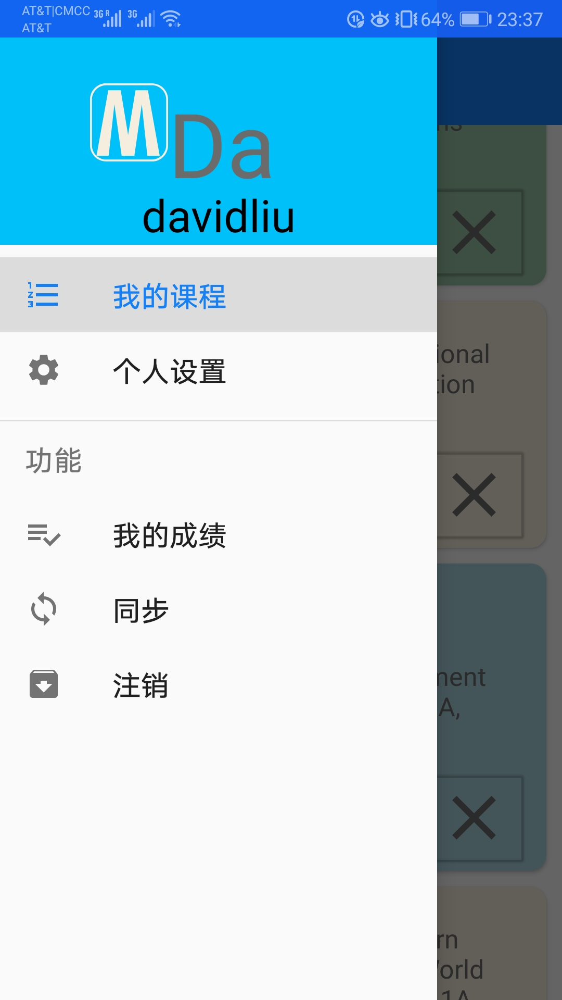
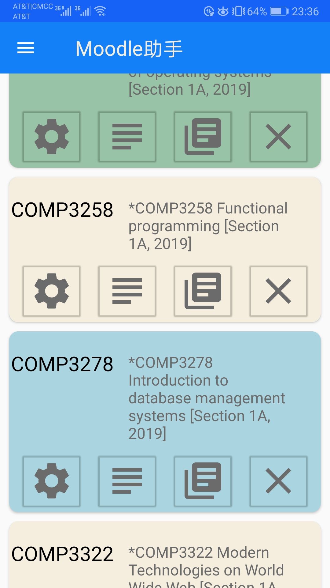
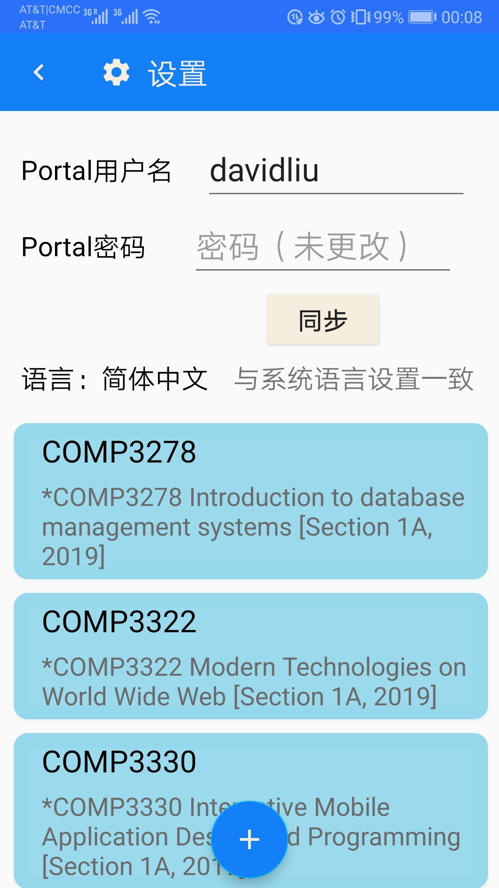
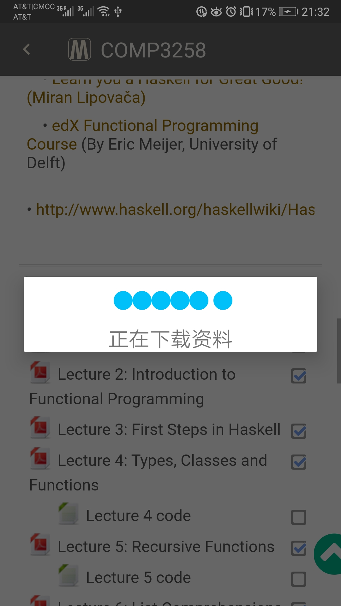
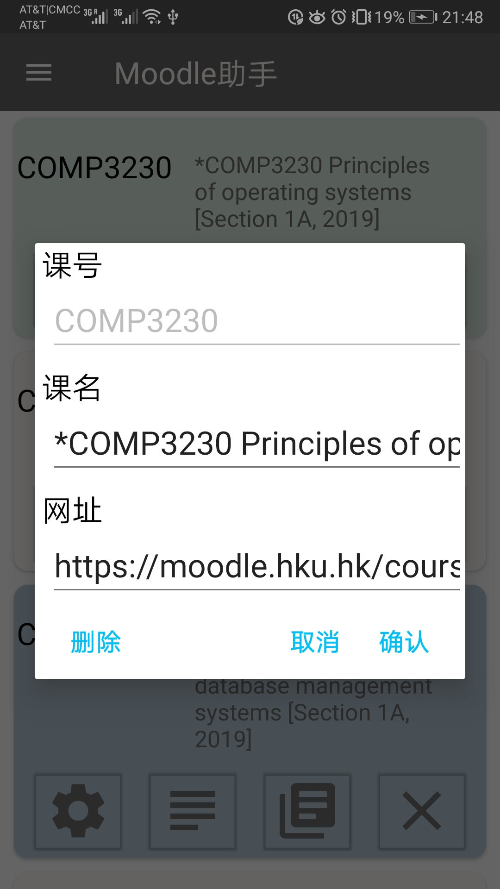

</img>
# HKU Moodle Helper

Maybe every student graduated from the University of Hong Kong will complain the 
[Moodle page](https://moodle.hku.hk) of this university which can be the most frequently used website
during their school time. The website is powerful, though, containing  all the learning resources and
quick links to all kinds of e-learning web pages. However, the HKU Moodle stores all the courses you
have ever taken, FOREVER. Consider that after 2 or 3 years in the University, you may have already enrolled
in many a course or activity. Most of them, although you are not going to access it any longer, still
appear in the webpage together with other courses. This makes the view messy. 

One solution to get rid of the mess is to access the courses via 
[HKU Portal](https://hkuportal.hku.hk) website. But that one is not friendly to mobile device users 
at all. Can you imagine that in the 21st century, the [Portal website](https://hkuportal.hku.hk) of a
[Top 30 university](https://www.topuniversities.com/universities/university-hong-kong/undergrad)
is not  responsive? Obviously, we can realize that accessing the courses resources on your mobile phone,
no matter which method to use, is annoying. 

#### Therefore, I have come up with this Android APP, enabling you to get to the courses you have enrolled in currently easily and conveniently. 

</img>
</img>
</img>
</img>

The dialogs:

</img>
</img>

## Basic Functionalities: 

Using the [APP](https://github.com/EE-LiuYunhao/moodlehelper/releases), you can 
 * add, edit or delete course cards;
 * jump to your course page directly; 
 * login automatically; 
 * download and view file directly without jumping to web browsers and login again.
 
## How to install

The APK file are included in the [*RELEASE*](https://github.com/EE-LiuYunhao/moodlehelper/releases). 
Go to the [*RELEASE*](https://github.com/EE-LiuYunhao/moodlehelper/releases) tab and you can download
it onto your mobile phones. 

### Requirements for devices: 
1. Android Devices
1. Version no lower than [Android 9.0 Pie](https://www.android.com/versions/pie-9-0/)
1. Storage permission are granted
1. With Internet connection

---
*Below is mainly for developers*

## Code Structure

Open the repo in Android Studio. 

The source codes are located in 
[`./app/src/main/java/src/main/java/cs/hku/hk/moodlehelper/`](https://github.com/EE-LiuYunhao/moodlehelper/tree/master/app/src/main/java/cs/hku/hk/moodlehelper).

There exist **TWO** packages. 

  - [**graphic**](https://github.com/EE-LiuYunhao/moodlehelper/tree/master/app/src/main/java/cs/hku/hk/moodlehelper/graphic)
contains the JAVA files for UI components, and 
  - [**support**](https://github.com/EE-LiuYunhao/moodlehelper/tree/master/app/src/main/java/cs/hku/hk/moodlehelper/supports)
contains those for adapters, customized listeners and etc. 

Resources file are in 
[`./app/src/main/java/src/main/res`](https://github.com/EE-LiuYunhao/moodlehelper/tree/master/app/src/main/res)
, includes the drawables, strings, color and etc. 
The javascripts which interact with Moodle website and layouts are in
[`./app/src/main/java/src/main/assets`](https://github.com/EE-LiuYunhao/moodlehelper/tree/master/app/src/main/assets). 

## Planned features
*Click [here](https://github.com/EE-LiuYunhao/moodlehelper/projects) to view the project TODO list*
- [x] Enable syncing with HKU Portal E-Learning. 
- [ ] Beautify the outlook and layouts.
- [x] Display the course names togethe with the course codes. 
- [ ] ... *Anything you feel important or interesting \^_\^*

-----

### Important
**Read through the [WIKI page](https://https://github.com/EE-LiuYunhao/moodlehelper/wiki)**
